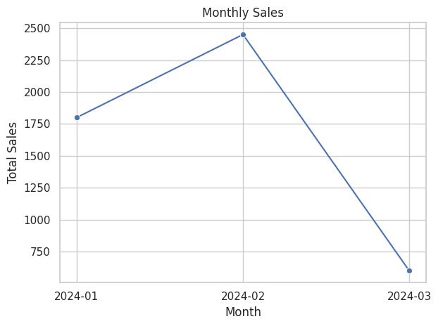

# 🛍 Customer Purchase Analysis – Data Analytics Project

This project analyzes customer purchase patterns from a retail dataset using Python and pandas. It focuses on monthly sales trends, top customers, and best-selling items.

## 📁 Dataset Overview
The dataset contains:
- InvoiceNo
- Customer
- Date
- Item
- Quantity
- Price

A new column `Total` was created (Quantity × Price), and `Month` was extracted from the date.

## 🔍 Key Analyses
- Monthly total sales trends using line plot
- Revenue grouped by month
- Cleaned and structured the dataset for business-ready use

## 🧰 Tools Used
- Python (Google Colab)
- pandas
- matplotlib
- seaborn

## 📊 Skills Demonstrated
- Data wrangling and datetime handling
- Grouping and aggregation in pandas
- Data visualization
- Exploratory Data Analysis (EDA)

---

🎯 **Goal:** Provide actionable insights from transaction data

👨‍💻 Check the Jupyter notebook to explore the full analysis.

